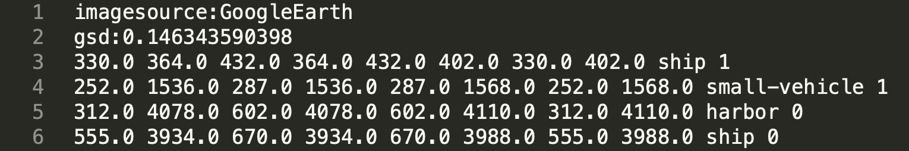
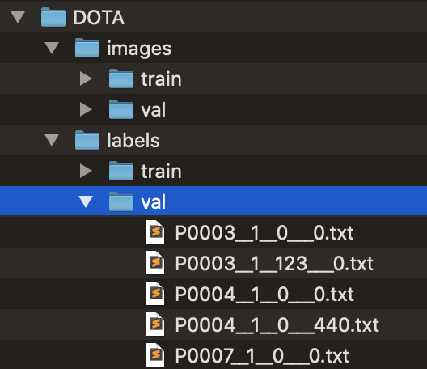

# 基于 YOLOv5 的卫星图像目标检测 


## 1 数据准备


### 1.1 数据集采集

本项目使用 DOTA 数据集，数据集链接：[下载地址](https://captain-whu.github.io/DOTA/dataset.html)

- 原数据集中待检测的目标

  <table>
  	<tr>
    	<td>
        <center></center>
        <center><font size=2>图1-1 目标类别</font></center>
      </td>
    </tr>
    <tr>
      <td>
        <center></center>
         <center><font size=2>图1-2 待检测目标一览</font></center>
      </td>   
    </tr>
  </table>

- 原数据集中的图像

  由 图1-3 可以看出原数据集中的图像尺寸和分辨率大小不一。

  <table>
  	<tr>
    	<td>
        <center></center>
        <center><font size=2>图1-3 数据集图像一览</font></center>
      </td>
    </tr>
  </table>

- 原数据集中的标签

  标签文件内容如 图1-4 所示。

  <table>
  	<tr>
    	<td>
        <center></center>
        <center><font size=2>图1-4 数据集标签一览</font></center>
      </td>
    </tr>
  </table>


  标签格式如下：

  ```
  'imagesource':<imagesource>
  'gsd':<gsd>
  <x1> <y1> <x2> <y2> <x3> <y3> <x4> <y4> <class> <difficulty>
  ```

  其中，

  - 1，2，3，4 分别为标记目标的四个点
  - `x`，`y` 为标记点的坐标值
  - `class` 为目标类别
  - `difficulty` 为检测难度（ 0/1：简单/困难 ）


### 1.2 标签格式转换和标签分布统计

YOLO 模型的标签输入有着特定的格式：

```
<class> <x_center> <y_center> <width> <height>
```

其中，

- `class` 为目标类别
- `x_center` 为标记框中心点的 x 坐标与图片宽度的比值
- `y_center` 为标记框中心点的 y 坐标与图片高度的比值
- `width` 为标记框的宽度与图片宽度的比值
- `height` 为标记框的高度与图片高度的比值

而原数据集中的标签数据格式和 YOLO 模型要求输入的标签数据格式不一致，因此我们将 DOTA 标签数据格式批量转换成 YOLO 标签数据格式，转换格式后标签文件内容如 图1-5 所示。

<table>
	<tr>
  	<td>
      <center></center>
      <center><font size=2>图1-5 格式转换后的数据集标签一览</font></center>
    </td>
  </tr>
</table>


格式转换后，我们统计了标签中各个参数的分布。

- 目标的数量分布

  <table>
  	<tr>
    	<td>
        <center></center>
        <center><font size=2>图1-6 各个类别目标分布数量的柱状图</font></center>
      </td>
    </tr>
  </table>

- 目标的尺寸分布

  <table>
  	<tr>
    	<td>
        <center></center>
        <center><font size=2>图1-7 目标尺寸分布的散点热力图</font></center>
      </td>
    </tr>
  </table>

- 目标的位置分布

  <table>
  	<tr>
    	<td>
        <center></center>
        <center><font size=2>图1-8 目标位置分布的散点热力图</font></center>
      </td>
    </tr>
  </table>


### 1.3 图像分割和尺寸调整

YOLO 模型的图像输入尺寸是固定的，由于原数据集中的图像尺寸不一，我们将原数据集中的图像按目标分布的位置分割成一个个包含目标的子图，并将每个子图尺寸调整为 1024×1024。分割前的图像如 图1-9 所示，分割后的子图效果如 图1-10 所示。

<table>
	<tr>
  	<td>
      <center></center>
      <center><font size=2>图1-9 分割前的图像</font></center>
    </td>
  </tr>
  <tr>
    <td>
      <center></center>
       <center><font size=2>图1-10 分割后的效果</font></center>
    </td>   
  </tr>
</table>


### 1.4 数据集目录结构调整

YOLOv5 在读取数据时使用特定的目录结构，调整后的数据集目录结构如 图1-11 所示，各个目录中的内容如 图1-12 ~ 图1-15 所示。

<table>
  <tr>
    <td>
      <center></center>
      <center><font size=2>图1-11 输入数据目录结构</font></center>
    </td>
  </tr>
  <tr>
  	<td>
      <center></center>
      <center><font size=2>图1-12 训练集图片目录内容</font></center>
    </td>
    <td>
      <center></center>
      <center><font size=2>图1-13 验证集图片目录内容</font></center>
    </td>
  </tr>
  <tr>
  	<td>
      <center></center>
      <center><font size=2>图1-14 训练集标签目录内容</font></center>
    </td>
    <td>
      <center></center>
      <center><font size=2>图1-15 验证集标签目录内容</font></center>
    </td>
  </tr>
</table>


## 2 模型训练


### 2.1 环境搭建

我们使用远程 GPU 服务器（MistGPU）训练模型，服务器硬件配置如 图2-1 所示。

<table>  
  <tr>    
    <td>      
      <center></center>      
      <center><font size=2>图2-1 GPU 服务器硬件配置</font></center>    
    </td>  
  </tr>
</table>


服务器软件配置：

- 操作系统：Ubuntu 18.04.4
- 开发和运行环境：
  - PyTorch 版本：1.6.0
  - CUDA 版本：10.2      

本地连接服务器的工具：FinalShell 1.0

首先我们在本地修改工程中相关配置文件并测试跑通：

- 在 `data/` 目录中创建 `DOTA.yaml` 配置文件，并设置自定义的数据集路径，如 图2-2所示
- 修改 `yolov5s(/*m/*l/*x).yaml` 中的 `nc` 参数值为自定义目标类别数

<table>  
  <tr>    
    <td>      
      <center></center>      
      <center><font size=2>图2-2 自定义数据集路径</font></center>    
    </td>  
  </tr>
</table>


然后我们将在本地调试好的 YOLOv5 工程打包压缩，将预处理好的数据集打包压缩，将两者上传至服务器。上传后分别用 unzip 命令解压，注意 YOLOv5 工程目录和数据集根目录要在同一级目录下，如 图2-3 所示。

<table>  
  <tr>    
    <td>      
      <center></center>      
      <center><font size=2>图2-3 数据集和YOLOv5目录的位置</font></center>    
    </td>  
  </tr>
</table>


进入 `yolov5/` 目录，使用以下命令安装 YOLOv5 工程所需的配置文件：

```
pip install -U -r requirements.txt
```


### 2.2 训练

在 `yolov5/` 目录，运行 `train.py` 文件开始训练：

```
screen python3 train.py --weight weights/yolov5s.pt --batch 16 --epochs 100 --cache
```

其中的参数说明：

- `--weight`：使用的预训练权重，这里示范使用的是 yolov5s 模型的预训练权重
- `--batch`：mini-batch 的大小，这里使用 16
- `--epochs`：训练的迭代次数，这里我们训练 100 个 epoch
- `--cache`：使用数据缓存，加速训练进程

另：命令开头使用的 `screen` 是 linux 的窗口管理器，可以使训练过程在后台运行，当网络不稳定导致服务器连接中断时，可以使用 `screen -r` 命令重新进入训练界面。

训练开始时的日志信息如 图2-4 所示，包括配置信息、网络架构等。

<table>  
  <tr>    
    <td>      
      <center></center>      
      <center><font size=2>图2-4 训练开始日志信息</font></center>    
    </td>  
  </tr>
</table>


训练过程的前3个 epoch 如 图2-5 所示。

<table>  
  <tr>    
    <td>      
      <center></center>      
      <center><font size=2>图2-5 训练过程日志信息</font></center>    
    </td>  
  </tr>
</table>


其中，

- `Epoch`：迭代数
- `gpu_mem`：使用的显存大小
- `GIoU`：GIoU 损失函数均值，此处打印的值是 L_GIoU=1-GIoU
- `obj`：目标检测的损失函数均值
- `cls`：目标分类的损失函数均值
- `total`：【暂不清楚】
- `targets`：【暂不清楚】
- `img_size`：图片尺寸（分辨率）
- `Class`：验证的目标类别
- `Images`：图片总数
- `Targets`：目标总数
- `P`：准确率【TP / (TP + FP)，即“找对的/找到的”】
- `R`：召回率【TP / (TP + FN)，即“找对的/该找对的”】
- `mAP@.5`：AP 是以 Precision 和 Recall 为两轴作图后曲线围成的面积，m 表示平均，@ 后面的数表示判定IoU 为正负样本的阈值
- `mAP@.5:.95`：表示在不同 GIoU 阈值（从0.5到0.95，步长0.05，即：0.5、0.55、0.6、0.65、0.7、0.75、0.8、0.85、0.9、0.95）上的平均 mAP

另：

- GIoU（Generalized Intersection over Union）定义如 图2-6 所示；IoU 定义如 图2-7 所示。

<table>  
  <tr>    
    <td>      
      <center></center>      
      <center><font size=2>图2-6 GIoU 定义</font></center>    
    </td>  
  </tr>
  <tr>    
    <td>      
      <center></center>      
      <center><font size=2>图2-7 IoU 定义</font></center>    
    </td>  
  </tr>
</table>


- mAP（mean Average Precision）定义：

  - mAP: mean Average Precision, 即各类别AP的平均值
  - AP: PR 曲线下面积
  - PR曲线: Precision-Recall 曲线
  - Precision: TP / (TP + FP)
  - Recall: TP / (TP + FN)
  - TP: IoU>0.5 的检测框数量（同一Ground Truth只计算一次）
  - FP: IoU<=0.5 的检测框数量，或者是检测到同一个 Ground Truth 的多余检测框的数量
  - FN: 没有检测到的 Ground Truth 的数量

  附：mAP 讲解：[理解目标检测当中的mAP](https://blog.csdn.net/hsqyc/article/details/81702437?utm_medium=distribute.pc_relevant_t0.none-task-blog-BlogCommendFromMachineLearnPai2-1.nonecase&depth_1-utm_source=distribute.pc_relevant_t0.none-task-blog-BlogCommendFromMachineLearnPai2-1.nonecase)

训练一个 epoch 后可以在 `runs/` 目录下看到改 epoch 各个训练 batch 的在图上的标签，如图 2-8 所示。

<table>  
  <tr>    
    <td>      
      <center></center>      
      <center><font size=2>图2-8 训练 batch 标签</font></center>    
    </td>  
  </tr>
</table>


### 2.3 训练和验证的结果

我们使用上述方法和数据集分别在基于 COCO 数据集的预训练模型 yolov5s 和 yolov5m 的基础上训练了自己的权重。yolov5s 模型训练用时 10 小时左右，yolov5m 模型训练用时 20 小时左右。

我们记录了每一个 epoch 的训练过程和验证过程的指标值，并绘制了评价指标曲线。yolov5s 模型的评价指标曲线如 图2-9 所示，yolov5m 评价指标模型的曲线如 图2-10 所示。

<table>  
  <tr>    
    <td>      
      <center></center>      
      <center><font size=2>图2-9 yolov5s 模型评价指标曲线</font></center>    
    </td>  
  </tr>
  <tr>    
    <td>      
      <center></center>      
      <center><font size=2>图2-10 yolov5m 模型评价指标曲线</font></center>    
    </td>  
  </tr>
</table>


其中，

- GIoU：训练集 GIoU 损失函数均值；该值越小，检测方框的精确度越高
- val GIoU：验证集 GIoU 损失函数均值；该值越小，检测方框的精确度越高
- Objectness：训练集目标检测损失函数均值；该值越小，目标检测的准确率越高
- val Objectness：验证集目标检测损失函数均值；该值越小，目标检测的准确率越高
- Classification：训练集目标分类的损失函数均值；该值越小，目标分类准确度越高
- val Classification：验证集目标分类的损失函数均值；该值越小，目标分类准确度越高
- Precision：准确率
- Recall：召回率
- mAP@0.5：GIoU 阈值为 0.5 的平均 AP 值
- mAP@0.5:0.95：在不同 IoU 阈值（从0.5到0.95，步长0.05）上的平均 mAP

由结果曲线可以看出，yolov5s 和 yolov5m 都取得了很好的结果，大部分曲线随着 epoch 数增加都趋于收敛。我们有以下结论：

1. yolov5m 的验证集目标检测损失函数值在 50 个 epoch 后有轻微的上升的趋势，说明在验证集上存在轻微的过拟合问题
2. yolov5s 和 yolov5m 在目标分类上都有着很好的效果
3. 同等迭代次数训练后，yolov5m 的准确率会超过 0.6，高于 yolov5s 的准确率
4. yolov5s 和 yolov5m 的 mAP 收敛值相差很小，但 yolov5m 会高于 yolov5s，即 yolov5m 的效果会稍好于 yolov5s


## 3 模型测试


### 3.1 模型效果测试

我们分别对训练好的 yolov5s 和 yolov5m 模型做卫星图像目标检测测试，测试结果如 图3-1 ~ 图3-4 所示。 

<table>
  <tr>
    <td>
      <center></center>
      <center><font size=2>图3-1-a yolov5s 测试结果1</font></center>
    </td>
    <td>
      <center></center>
      <center><font size=2>图3-1-b yolov5m 测试结果1</font></center>
    </td>
  </tr>
  <tr>
  	<td>
      <center></center>
      <center><font size=2>图3-2-a yolov5s 测试结果2</font></center>
    </td>
    <td>
      <center></center>
      <center><font size=2>图3-2-b yolov5m 测试结果2</font></center>
    </td>
  </tr>
  <tr>
  	<td>
      <center></center>
      <center><font size=2>图3-3-a yolov5s 测试结果3</font></center>
    </td>
    <td>
      <center></center>
      <center><font size=2>图3-3-b yolov5m 测试结果3</font></center>
    </td>
  </tr>
  <tr>
  	<td>
      <center></center>
      <center><font size=2>图3-4-a yolov5s 测试结果4</font></center>
    </td>
    <td>
      <center></center>
      <center><font size=2>图3-4-b yolov5m 测试结果4</font></center>
    </td>
  </tr>
</table>


yolov5s 和 yolov5m 模型的每张图片推断用时如 图3-5 和 图3-6 所示。

<table>  
  <tr>    
    <td>      
      <center></center>      
      <center><font size=2>图3-5 yolov5s 模型推断用时</font></center>    
    </td>  
  </tr>
  <tr>    
    <td>      
      <center></center>      
      <center><font size=2>图3-6 yolov5m 模型推断用时</font></center>    
    </td>  
  </tr>
</table>


### 3.2 模型效果总结

总的来说，yolov5s 和 yolov5m 模型效果相差不大，都能检测到给定图像中的大部分目标并正确分类。

 模型效果总结：

- yolov5m 在给定图像的目标检测数量上强于 yolov5s
- yolov5m 极少数情况下会将图像中个别目标错误分类，yolov5s 这种情况较为少见
- yolov5s 和 yolov5m 都能准确地框住目标，且两者都能准确地检测到图像边缘的不完整目标
- yolov5s 和 yolov5m 在图像分辨率较低或者目标有半透明云层遮挡情况下都能检测到目标
- yolov5s 比 yolov5m 推断用时少大约一倍


## 4 未来工作

日后将考虑训练 yolov5l 以及 yolov5x 模型，增加所有模型的训练 epoch 数到 300，并对比各个模型的优劣。
